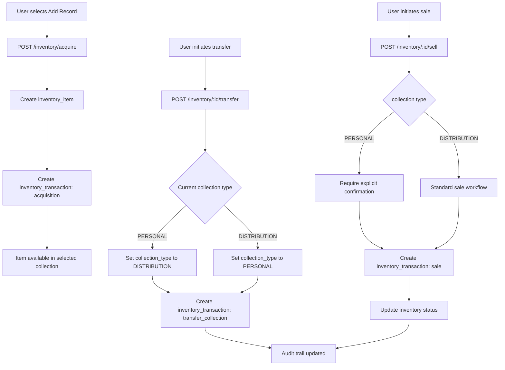

# Record Ranch Inventory System – Architecture

## Overview

The system is designed to support a dual-collection inventory with auditability, developer accessibility, and eventual integration with Discogs.

---

## Components

### 1. Database

- PostgreSQL (RDS)
- Tables:
  - `inventory_item`
  - `inventory_transaction`
  - `pressing` (Discogs reference)
- Features:
  - Transaction logging
  - Collection type enforcement
  - PITR and snapshots

### 2. API Layer

- FastAPI
- Endpoints:
  - `POST /inventory/acquire`
  - `POST /inventory/{id}/sell`
  - `POST /inventory/{id}/transfer`
  - `GET /inventory?collection=PERSONAL|DISTRIBUTION`
  - `GET /transactions`
  - `POST /imports/access/validate`
  - `POST /imports/access/commit`
  - `GET /imports/{id}`
  - `GET /imports/{id}/errors`

### 3. Web UI

- React or Vue (TBD)
- Distinguishes PERSONAL vs DISTRIBUTION visually
- Sale confirmation for personal items
- Listing optimized for quick sales workflows

### 4. Developer Environment

- Python 3.14 virtual environment via `env.sh`
- Required packages installed via `requirements.txt`
- Workflow:
  1. Source environment
  2. Run server or scripts
  3. Optional S3 upload for images

### 5. Backup & Storage

- RDS PITR enabled
- S3 snapshots for optional record images
- Logical backups exported periodically

### 6. Legacy Import Boundary

- Web app supports importing legacy Microsoft Access inventory exports
- Import is staged, validated, and then mapped into local inventory and metadata tables
- Import behavior details and field mappings are defined in design

---

## Data Flow

1. **Acquisition**
   - User adds record → creates `inventory_item` + `inventory_transaction`
2. **Transfer**
   - PERSONAL ↔ DISTRIBUTION
   - Transaction created with type `transfer_collection`
   - Item collection type updated
3. **Sale**
   - `inventory_transaction` recorded
   - Inventory updated
4. **Legacy Import**
  - User uploads Access exports via web workflow
  - System validates and stages rows before writing canonical inventory records

### Data Flow Diagram

---

## Security & Compliance

- Role-based access control for UI/API
- Audit trail for all collection changes
- No silent reclassification
- Encrypted backups

---

## Optional Extensions

- Discogs integration for auto-populating metadata
- Analytics dashboards
- Automated premium pricing for PERSONAL collection

### Discogs Integration (High Level)

- Integration role:
  - Discogs is an external metadata source for enrichment, not a system of record for inventory ownership state
- Boundary:
  - Discogs-facing ingestion and synchronization behavior is documented in design
- Reliability principles:
  - Use resilient fetch pipelines with throttling, retries, and idempotent upserts
- Compliance principles:
  - Follow Discogs API terms and data usage constraints
