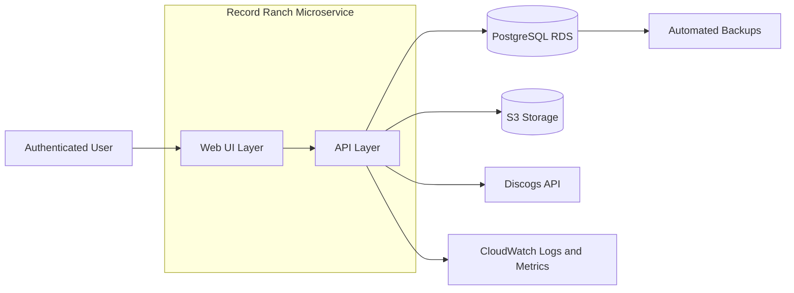
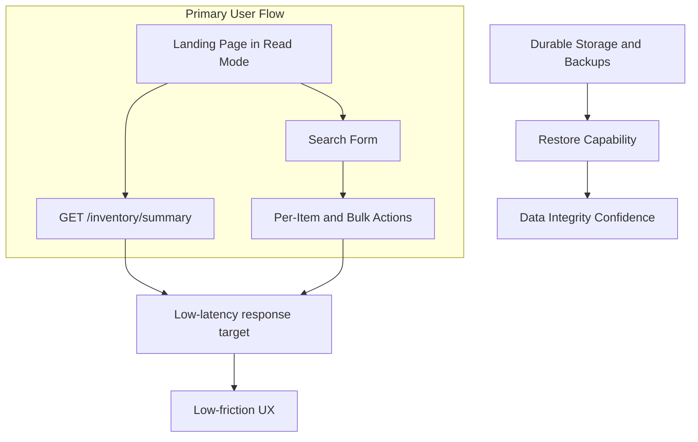
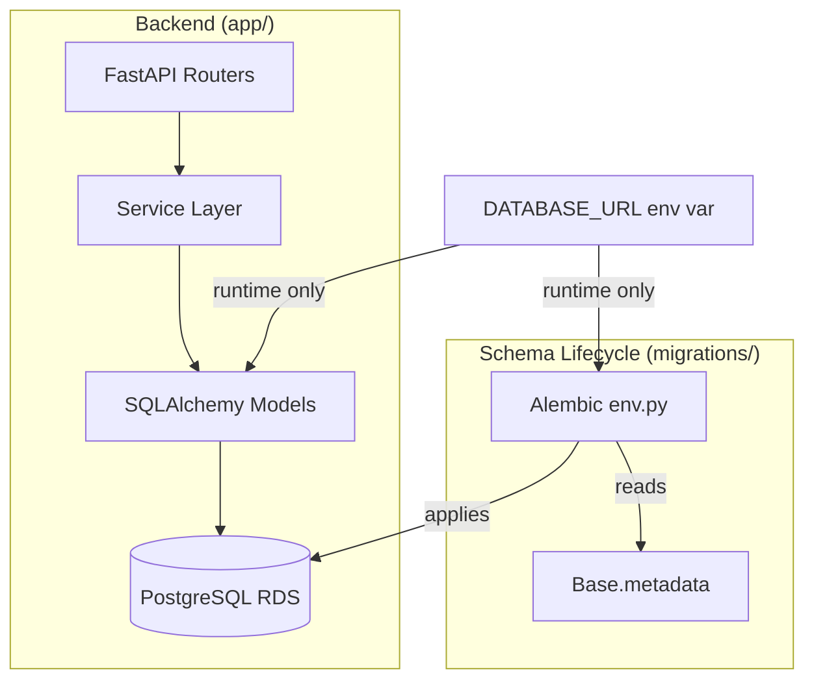
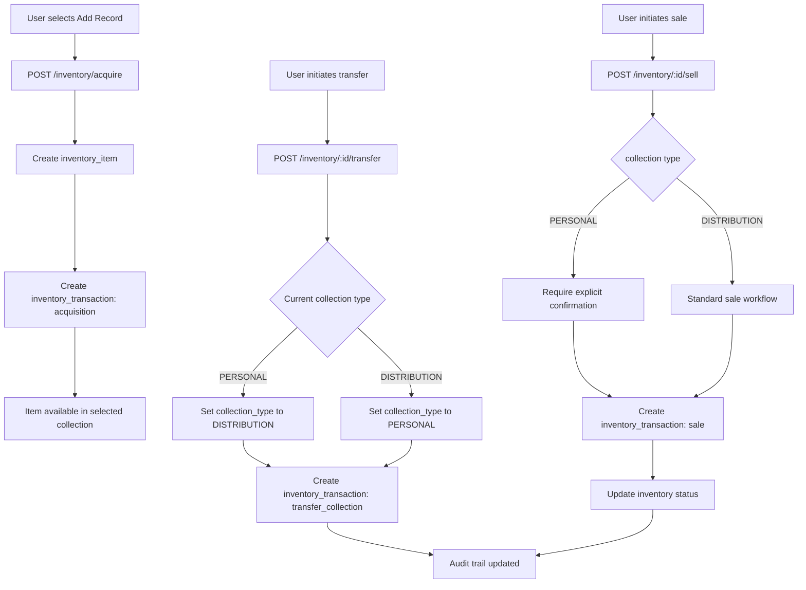

# Record Ranch Inventory System – Architecture

## Overview

The system is designed to support a dual-collection inventory with auditability, developer accessibility, and eventual integration with Discogs.

Deployment intent:

- Web application is served as an AWS-hosted microservice
- High availability is not a primary requirement for this single-user workload
- Backup, data durability, and restore capability are mandatory
- Performance and low UX friction are first-class requirements

---

## Architecture Diagram

### Interaction and Priority Diagram

---

## Components

### 1. Database

- PostgreSQL (RDS)
- Tables:
  - `inventory_item`
  - `inventory_transaction`
  - `pressing` (Discogs reference, future)
- Features:
  - Transaction logging
  - Collection type enforcement
  - PITR and snapshots

#### 1a. ORM / Model Layer

- SQLAlchemy 2.x declarative models in `app/models/`
- `app/db.py` provides `Base` (shared metadata), `get_engine()` (lazy singleton), and `get_db()` (FastAPI session dependency)
- Engine is initialized on first use to avoid import-time side effects

#### 1b. Schema Migrations

- Alembic manages all schema changes under `migrations/`
- `DATABASE_URL` is resolved from the environment at runtime; no credentials are hardcoded in `alembic.ini`
- New migrations must be created manually or via `alembic revision --autogenerate` after model changes
- See `docs/runbooks/db-migrations.md` for operational procedures

### 2. API Layer

- FastAPI
- Endpoints:
  - `POST /inventory/acquire`
  - `PATCH /inventory/{id}`
  - `DELETE /inventory/{id}`
  - `POST /inventory/{id}/sell`
  - `POST /inventory/{id}/transfer`
  - `POST /inventory/bulk/transfer`
  - `POST /inventory/bulk/update`
  - `POST /inventory/bulk/delete`
  - `GET /inventory?collection=PERSONAL|DISTRIBUTION`
  - `GET /inventory/summary`
  - `GET /transactions`
  - `POST /imports/access/validate`
  - `POST /imports/access/commit`
  - `GET /imports/{id}`
  - `GET /imports/{id}/errors`

### 3. Web UI

- React (Vite + TypeScript)
- Unauthenticated users see a login prompt on landing
- Authenticated users start in read mode with a default search form
- Logged-in landing view surfaces inventory totals grouped by collection
- Read mode exposes transfer/update/delete item actions through buttons or menus
- Read mode supports bulk transfer/update/delete workflows on selected results
- Bulk selection supports per-row checkboxes plus select-all-current-page/select-all-results controls
- Read mode surfaces Discogs market/value signals when available for user decision support
- Distinguishes PERSONAL vs DISTRIBUTION visually
- Sale confirmation for personal items
- Listing optimized for quick sales workflows

### 3a. AWS Microservice Profile

- App/API service runs as a single microservice workload in AWS
- Public ingress is controlled through an HTTPS endpoint and authentication
- Data tier and object storage are managed AWS services
- Service design favors simple operation with durable state and fast interaction paths over HA complexity

### 3b. Infrastructure Baseline (Terraform Scaffold)

Current baseline infrastructure is defined as Terraform in `infra/` and includes:

- Networking:
  - VPC with two public and two private subnets across two AZs
  - Internet gateway and public routing
  - Separate security groups for app and database tiers
- Database:
  - Amazon RDS PostgreSQL 16
  - Encrypted storage, automated backups, and point-in-time recovery retention
  - Deletion protection enabled
  - Single-AZ deployment by design for current workload profile
- Authentication:
  - Amazon Cognito user pool and app client
  - Email-based sign-in with optional TOTP MFA
- Object storage:
  - Private S3 bucket for record images
  - Public access blocked, versioning enabled, server-side encryption enabled
- Secret management:
  - Database credentials stored in AWS Secrets Manager

Runtime deployment note:

- Application runtime resources (for example App Runner/ECS service wiring) are intentionally deferred until the app image pipeline exists.

### 4. Developer Environment

- Python 3.14 virtual environment via `env.sh`
- Required packages installed via `requirements.txt`
- Workflow:
  1. Source environment (`source venv/bin/activate` or `. env.sh`)
  2. Set `DATABASE_URL` (and other required env vars) before running migrations or the server
  3. Apply pending schema migrations: `alembic upgrade head`
  4. Run server: `uvicorn app.main:app --reload`
  5. Optional S3 upload for images
- See `docs/runbooks/db-migrations.md` for full migration reference

### 5. Backup & Storage

- RDS PITR enabled
- S3 snapshots for optional record images
- Logical backups exported periodically

### 6. Legacy Import Boundary

- Web app supports importing legacy Microsoft Access inventory exports
- Import is staged, validated, and then mapped into local inventory and metadata tables
- Import behavior details and field mappings are defined in design

---

## Data Flow

1. **Acquisition**
   - User adds record → creates `inventory_item` + `inventory_transaction`
2. **Transfer**
   - PERSONAL ↔ DISTRIBUTION
   - Transaction created with type `transfer_collection`
   - Item collection type updated
3. **Sale**
   - `inventory_transaction` recorded
   - Inventory updated

4. **Legacy Import**
   - User uploads Access exports via web workflow. The system validates and stages
    rows before writing canonical inventory records.

Data Flow Diagram scope note:

- The Mermaid diagram below visualizes core inventory lifecycle actions (acquire, transfer, sell).
- Legacy import flow is documented in design and represented as a separate import pipeline.

### Data Flow Diagram

---

## Security & Compliance

- Role-based access control for UI/API
- Audit trail for all collection changes
- No silent reclassification
- Encrypted backups
- RDS master credentials are managed by AWS and retrieved via Secrets Manager integration

## Operational Priorities

1. Data durability and recoverability
2. Performance and low UX friction
3. Simplicity of operations for a single-user workload
4. High availability as an optional future enhancement

---

## Optional Extensions

- Discogs integration for auto-populating metadata
- Analytics dashboards
- Automated premium pricing for PERSONAL collection

### Discogs Integration (High Level)

- Integration role:
  - Discogs is an external metadata source for enrichment, not a system of record for inventory ownership state
- Boundary:
  - Discogs-facing ingestion and synchronization behavior is documented in design
- Reliability principles:
  - Use resilient fetch pipelines with throttling, retries, and idempotent upserts
- Compliance principles:
  - Follow Discogs API terms and data usage constraints
