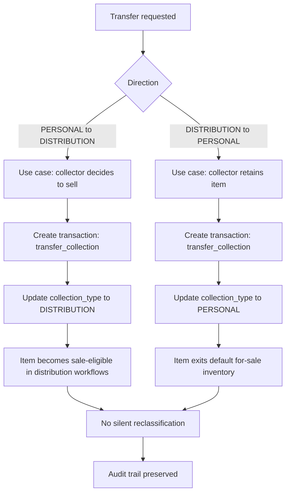
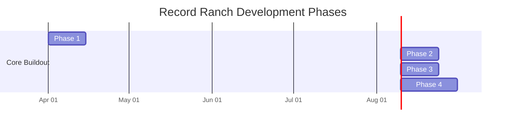

# Record Ranch Inventory System – Design

## Overview

A private inventory system supporting:

- Discogs-based cataloging
- Transaction-driven lifecycle
- Dual collection model

Operational profile assumptions:

- AWS-hosted web microservice deployment
- High availability is not required for this single-user workload
- Mandatory backup and restore readiness
- Performance and low UX friction as core product requirements

---

## Design Decisions

### Discogs Integration: Lean Schema and On-Demand Fetches (April 2026)

**Decision:** `pressing` stores a lean eight-column bookmark (id, created_at, discogs_release_id, discogs_resource_url, title, artists_sort, year, country). All Discogs detail data — tracks, images, credits, labels, identifiers, market signals, community signals, raw payload — is fetched on demand via a proxy endpoint and is never stored locally.

**Rationale:**
- Storage costs money. Discogs data is large and changes frequently; local copies would be expensive and stale.
- Discogs is an authoritative, reliable read-only source; duplicating it locally provides no data safety benefit.
- At human interaction pace, the 60 req/min authenticated rate limit is not a practical constraint.
- On-demand model eliminates background sync jobs, stale-data detection, and sync-status bookkeeping entirely.

**Consequences:**
- Phase B child tables (pressing_track, pressing_identifier, pressing_image, pressing_video, pressing_credit, pressing_company, pressing_label) are cancelled.
- Phase C background sync is cancelled.
- The Discogs API is called only on explicit user action (search, release detail, image load). No background API calls are made.
- Market signals are displayed in the release detail panel on user request; they are not shown in list views.

See [design-discogs.md](design-discogs.md) for full integration design.

---

## Non-Functional Requirements

### Performance Priorities

- Landing page summary and default search interactions should feel immediate to the user
- Inventory read endpoints must be optimized for low-latency, paginated access patterns
- Bulk action preparation (selection, validation preview, confirmation) must remain responsive under documented selection bounds

### UX Friction Priorities

- Common actions (search, transfer, update, delete, bulk operations) should be executable from the default read-mode workflow with minimal navigation
- Authenticated users should reach actionable inventory context quickly after login
- The interface should prefer progressive disclosure over multi-step modal chains for routine actions
- Acquiring a new item requires the fewest possible steps: enter search text, select from Discogs results, confirm acquisition details
- Editing an existing item follows the same pattern: search Discogs, select a pressing, confirm changes
- When a Discogs match is unavailable, the user must still be able to add or edit the item using manual entry without leaving the primary workflow

### Availability and Durability Posture

- High availability is optional and can be deferred for this workload
- Backup and restore requirements are mandatory and must be validated operationally
- Durability protections must apply to inventory state, transaction history, and import metadata

## Infrastructure Implementation Constraints

### Baseline Platform Contract (Current)

- Infrastructure is provisioned from Terraform under `infra/`.
- Current baseline services are:
  - VPC networking with public/private subnet separation
  - RDS PostgreSQL 16 as primary transactional datastore
  - Cognito user pool plus app client for authentication
  - Private S3 bucket for record image assets
  - Secrets Manager for database credentials
  - Lambda function (Python 3.13, zip package) as the application runtime; serves both the FastAPI backend and the pre-built React UI as static files; VPC-attached to private subnets
  - API Gateway HTTP API (v2) as the public HTTPS ingress; `AWS_PROXY` integration (payload format 2.0); stage-level throttling and access logging to CloudWatch enabled

### Backup and Restore Constraints

- RDS automated backups and PITR retention are mandatory and configured in infrastructure.
- DB deletion protection must remain enabled in non-ephemeral environments.
- Restore validation is an explicit operations responsibility and must be exercised via runbook.

### Availability Tradeoff (Explicit)

- RDS is currently single-AZ by design to prioritize operational simplicity and cost for a single-user workload.
- Multi-AZ is a planned enhancement path when availability requirements change.

### Secret Management Boundary

- Database credentials for all shared, dev, stage, and production environments must be sourced from secret management at runtime (for example, AWS Secrets Manager).
- Committed files may only contain non-functional placeholders or explicitly documented local-dev example values (for example, in `env.sh`), and must never contain real credentials, tokens, or connection strings for any environment.
- Real `DATABASE_URL` and similar values must be supplied out-of-band via secret management, git-ignored local files, or deployment-time environment configuration, never via checked-in source.

### Environment Configuration Contract

Application runtime must be configurable with infrastructure-produced values, including:

- database endpoint and port
- database name
- secret identifier for credential retrieval
- Cognito user pool and app client identifiers
- S3 image bucket name

---

## Core Concepts

### Collection Type (NEW)

Each inventory item belongs to one of:

- PERSONAL
- DISTRIBUTION

---

## Data Model Updates

### Inventory Item (Updated)

```sql
inventory_item (
  id                   UUID PK,
  pressing_id          UUID NULL,           -- FK to pressing; populated during acquire/edit via Discogs search-and-select (Phase A); nullable to support manual entry without a Discogs match
  acquisition_batch_id UUID NULL,          -- shared across batch-acquired copies
  collection_type      TEXT NOT NULL CHECK (collection_type IN ('PERSONAL','DISTRIBUTION')),
  condition_media      TEXT NULL,
  condition_sleeve     TEXT NULL,
  is_sealed            BOOLEAN NULL,        -- NULL = not recorded; TRUE = factory sealed; FALSE = confirmed open
                                             -- Sealed status is independent of condition grades: media condition
                                             -- is ungraded for sealed copies; sleeve may still be graded
  status               TEXT NOT NULL DEFAULT 'active'
                            CHECK (status IN ('active','sold','lost','deleted')),
  notes                TEXT NULL,
  created_at           TIMESTAMPTZ NOT NULL DEFAULT now(),
  deleted_at           TIMESTAMPTZ NULL     -- NULL = not deleted (soft-delete)
)
```

Indexes:

- `ix_inventory_item_acquisition_batch_id` on `acquisition_batch_id` — supports grouping queries for batch-acquired copies

Soft-delete contract:

- `DELETE /inventory/{id}` sets `deleted_at = now()` and `status = 'deleted'`; the row is never physically removed
- Read endpoints filter `deleted_at IS NULL` by default
- Transaction and audit records for deleted items are preserved

---

### Inventory Transaction (Updated)

```sql
inventory_transaction (
  id                 UUID PK,
  inventory_item_id  UUID FK REFERENCES inventory_item(id) ON DELETE RESTRICT,
  transaction_type   TEXT NOT NULL CHECK (transaction_type IN
                       ('acquisition','sale','transfer_collection','trade','loss','adjustment')),
  price              NUMERIC(10,2) NULL,
  counterparty       TEXT NULL,
  notes              TEXT NULL,
  created_at         TIMESTAMPTZ NOT NULL DEFAULT now()
)
```

Indexes:

- `ix_inventory_transaction_inventory_item_id` on `inventory_item_id` — supports per-item history lookups

FK constraint uses `ON DELETE RESTRICT`: transactions cannot be orphaned; inventory items must be soft-deleted rather than physically removed.

---

### Transaction Types

- acquisition
- sale
- transfer_collection   <-- NEW
- trade
- loss
- adjustment

---

## Collection Rules

### PERSONAL Collection

- Default: not for sale
- Sale requires explicit action
- May have:
  - premium pricing
  - restricted visibility

---

### DISTRIBUTION Collection

- Default: available for sale
- Standard workflows apply

---

## Duplicate-Copy Entry Model

The system supports fast entry for duplicate copies while preserving per-item traceability.

### Storage of Duplicates

- Canonical storage remains one row per physical copy in `inventory_item`
- No global `quantity` column is stored on `inventory_item`
- Multiple copies of the same release share the same `pressing_id`
- Each created copy retains independent lifecycle and condition history

### Quantity-Assisted Acquisition

`POST /inventory/acquire` supports a quantity input for UX efficiency.

Request contract additions:

- `quantity` (integer, optional, default `1`, minimum `1`, maximum `100`)
- Requests above the maximum are rejected by validation and must be split across multiple acquisition requests
- Shared fields apply to all generated copies by default
- Optional per-copy overrides are allowed in a later phase

Behavior:

- Create `quantity` number of `inventory_item` rows in a single operation (bounded by the documented maximum)
- Assign a shared `acquisition_batch_id` to all rows created from that request
- Create one `inventory_transaction` per created item with `transaction_type = acquisition`

Failure mode:

- Default behavior is atomic: if any row fails validation/persistence, the full acquisition request is rolled back
- Quantity-above-maximum is treated as a validation error and creates no rows

### Rationale

- Preserves copy-level condition, status, and transaction history
- Supports independent later sale/transfer of any one copy
- Reduces operator friction for collectors entering near-identical duplicates

### Example (Conceptual)

Input: quantity `5` for one selected pressing

Result:

- 5 `inventory_item` rows (same `pressing_id`, same `acquisition_batch_id`)
- 5 acquisition transactions (one per item)
- Inventory list can group by `acquisition_batch_id` for review, then show item-level detail

---

## Transfer Workflow (Critical)

### PERSONAL → DISTRIBUTION

Use case:

- Collector decides to sell

Action:

- Create transaction:
  - type: transfer_collection
- Update:
  - collection_type = DISTRIBUTION

---

### DISTRIBUTION → PERSONAL

Use case:

- Collector retains item

Same transaction model

### Transfer Workflow Diagram



---

## API Updates

POST /inventory/acquire (supports quantity-assisted creation)
PATCH /inventory/{id}
DELETE /inventory/{id}
POST /inventory/{id}/sell
POST /inventory/{id}/transfer
POST /inventory/bulk/transfer
POST /inventory/bulk/update
POST /inventory/bulk/delete
GET  /inventory?collection=PERSONAL|DISTRIBUTION
GET  /inventory/summary
GET  /transactions
GET  /discogs/releases?q=... (release search proxy — requires app authentication (Cognito JWT); proxies to Discogs public database search, which does not require Discogs user auth; rate-limited; returns candidate pressings for selection in acquire and edit flows)
GET  /discogs/releases/{discogs_release_id} (release detail proxy — requires app authentication (Cognito JWT); fetches full Discogs release payload on demand; detail data is returned to the client and not stored locally; use cases: tracks, credits, images, market signals)
POST /imports/access/validate
POST /imports/access/commit
GET  /imports/{id}
GET  /imports/{id}/errors

### Auth & Authorization for Import Endpoints

- All `/imports/*` endpoints MUST require an authenticated user.
- `/imports` follows the same RBAC model as other state-changing inventory APIs (for example `POST /inventory/...`).
- Implementations MUST NOT expose any unauthenticated import path; on missing or invalid auth context, `/imports` requests MUST fail closed.

### Auth & Authorization for Inventory State-Changing Endpoints

- All state-changing `/inventory/*` endpoints MUST require authenticated and authorized (RBAC) access.
- This includes single-item and bulk routes, including `POST`, `PATCH`, and `DELETE` inventory operations.
- UI visibility controls are convenience only and MUST NOT be treated as authorization controls.
- On missing or invalid auth context, inventory state-changing requests MUST fail closed.

#### Role Model

- Role membership is determined by the `cognito:groups` claim in the Cognito ID token.
- The `admin` Cognito group grants write access to all state-changing inventory endpoints.
- Users not in the `admin` group are read-only: they may use `GET /inventory` and `GET /inventory/summary` but receive `403 Forbidden` on `POST /inventory/acquire`, `PATCH /inventory/{id}`, and `DELETE /inventory/{id}`.
- Group membership is managed in Cognito by an administrator; it is not self-assignable.
- The `admin` group is provisioned via Terraform (`infra/auth.tf`).

### Auth & Authorization for Inventory Read Endpoints

- Inventory read endpoints exposed in authenticated UI flows MUST require authenticated access.
- `GET /inventory/summary` MUST be scoped to the current authenticated user context and MUST NOT be treated as a public endpoint.
- If authorization boundaries are introduced for inventory visibility, inventory read endpoints MUST apply the same scoped access rules consistently.

---

## UI Behavior

### Landing Page and Default Mode

- If user is not authenticated, the landing page presents a login prompt
- After users are authenticated, the landing page defaults to read mode
- The logged-in landing page displays total inventory counts grouped by collection
- In read mode, a search form is presented by default
- Collection counts include totals for both PERSONAL and DISTRIBUTION collections
- Inventory results expose controls to invoke transfer, update, and delete actions
- Transfer, update, and delete controls may be presented as buttons or menus
- Search-result actions assume operator intent to manage item lifecycle after lookup

### Acquire Flow

- User initiates acquire from the default view
- User enters search text; the app calls `GET /discogs/releases?q=...` and presents candidate pressings
- User selects a pressing from the results to populate acquisition details
- If no Discogs match exists, the user may proceed with manual entry and still complete acquisition
- Confirmed acquisition with a Discogs selection calls `POST /inventory/acquire`; the selected pressing is upserted and the new inventory item is linked via `pressing_id` automatically
- Confirmed acquisition via manual entry still calls `POST /inventory/acquire`; no Discogs pressing is upserted or linked, and the new inventory item is created with `pressing_id = null`

### Edit Flow

- User opens edit for an existing inventory item
- User may enter search text to find a new or corrected Discogs pressing; the app calls `GET /discogs/releases?q=...` and presents candidates
- User selects a pressing to update the item's `pressing_id` linkage
- If no Discogs match exists, the user may update item fields manually without re-linking a pressing
- Confirmed edits call `PATCH /inventory/{id}`

### Inventory Row Actions

- Transfer action opens collection-transfer workflow for the selected item
- Update action opens edit workflow for the selected item
- Delete action opens delete confirmation for the selected item
- Transfer, update, and delete actions are not shown to unauthenticated users
- Transfer, update, and delete actions are not shown to authenticated users who lack the `admin` role
- `DELETE /inventory/{id}` represents a logical delete (soft delete) for auditability; item history remains preserved

### Bulk Operations

- Search results are presented in a list/table with a checkbox next to each record
- Search results support multi-select so operators can apply actions to multiple records
- Selection controls include:
  - select all records on the current page
  - select all records returned by the current search (bounded by guardrails below)
- Search results are paginated; "current search" refers to a bounded, filtered result set
- Bulk selection guardrails:
  - the UI must display both total matched count and selected count
  - a maximum of 5,000 inventory items may be selected in one bulk operation
  - client and server both enforce the selection maximum
- Bulk workflows include transfer, update, and delete for selected items
- Bulk actions are launched from read-mode controls (for example bulk action menu or toolbar)
- Bulk endpoints operate on an explicit finite list of `inventory_item` IDs from a point-in-time selection
- Bulk delete requires explicit confirmation before execution, including affected record count
- `POST /inventory/bulk/delete` uses the same logical delete (soft delete) semantics as `DELETE /inventory/{id}`
- Bulk delete must preserve per-item history and transaction/audit records for each affected item
- Bulk operations are not available to unauthenticated users

### Market Value Signal Presentation

- Discogs market and community signals (lowest price, num_for_sale, have/want counts, rating) are fetched on demand from the Discogs API via the release detail proxy endpoint and are never stored locally.
- These signals are displayed in the release detail panel or item-detail view when the user explicitly opens it.
- The interface must label these as market signals for decision support, not authoritative local valuation.
- If Discogs market data is unavailable or the on-demand fetch fails, the interface must display an explicit unavailable state.
- Signals must not be retrieved in the background or pre-fetched for list views; fetches are user-triggered only.

### Personal Collection Pricing

- Visually distinct (badge/label)
- Sale action requires confirmation
- Possibly hidden from “for sale” views

### Distribution Inventory

- Default listing view
- Optimized for quick sales workflows

---

## Pricing Behavior

### Personal Collection

- Manual pricing
- Optional premium multiplier (future)

### Distribution

- Market-based pricing (Discogs integration later)
- Discogs market/value signals should be visible in distribution workflows to inform operator pricing decisions

---

## Auditability

- All collection changes recorded as transactions
- No silent reclassification
- Bulk transfer and bulk update operations must retain per-item audit records

---

## Backup Strategy

Unchanged:

- RDS PITR
- S3 snapshot export
- logical backups

---

## Legacy Microsoft Access Import Design

The import pipeline design — source model, staging strategy, field mapping, validation rules, dedupe rules, auditability requirements, UI requirements, and vinyl identifier domain notes — is documented in full in [design-import.md](design-import.md).

---

## Discogs Integration Design

The Discogs integration design — API contract, rate limiting, pagination rules, schema extension strategy, full SQL target schema, phased migration plan, field mapping table, data quality notes, image handling, sync workflow, and compliance notes — is documented in full in [design-discogs.md](design-discogs.md).

---

## Risks

| Risk | Mitigation |
| ----- | ----------- |
| accidental sale of personal item | confirmation + UI separation |
| incorrect classification | allow easy transfer |
| pricing confusion | separate pricing flows |

---

## Deferred Features

- automated pricing rules
- valuation tracking for personal collection
- image support

---

## Development Plan Updates

### Phase 1

- acquisition + collection assignment

### Phase 2

- transfer workflows

### Phase 3

- pricing differentiation

### Phase 4

- analytics + valuation

### Development Roadmap Diagram



---

## Summary

This system now supports:

- inventory lifecycle tracking
- dual-purpose collection management
- clear separation of collector vs dealer intent

This aligns with real-world usage of serious collectors who also operate as sellers.
