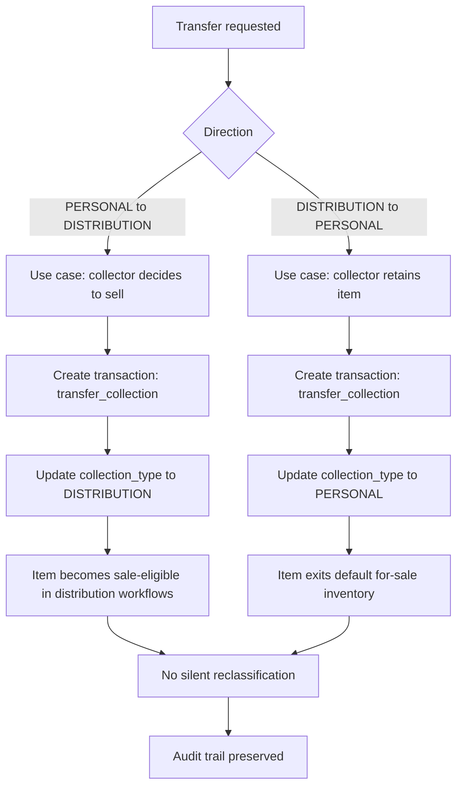
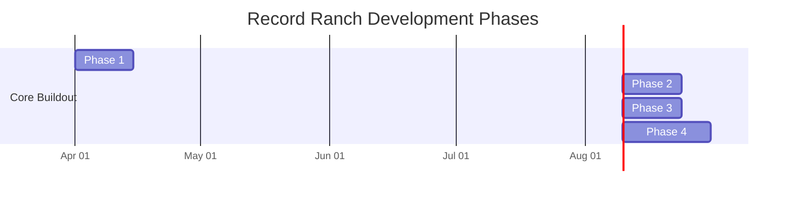

# Record Ranch Inventory System – Design

## Overview

A private inventory system supporting:

- Discogs-based cataloging
- Transaction-driven lifecycle
- Dual collection model

Operational profile assumptions:

- AWS-hosted web microservice deployment
- High availability is not required for this single-user workload
- Mandatory backup and restore readiness
- Performance and low UX friction as core product requirements

---

## Non-Functional Requirements

### Performance Priorities

- Landing page summary and default search interactions should feel immediate to the user
- Inventory read endpoints must be optimized for low-latency, paginated access patterns
- Bulk action preparation (selection, validation preview, confirmation) must remain responsive under documented selection bounds

### UX Friction Priorities

- Common actions (search, transfer, update, delete, bulk operations) should be executable from the default read-mode workflow with minimal navigation
- Authenticated users should reach actionable inventory context quickly after login
- The interface should prefer progressive disclosure over multi-step modal chains for routine actions

### Availability and Durability Posture

- High availability is optional and can be deferred for this workload
- Backup and restore requirements are mandatory and must be validated operationally
- Durability protections must apply to inventory state, transaction history, and import metadata

## Infrastructure Implementation Constraints

### Baseline Platform Contract (Current)

- Infrastructure is provisioned from Terraform under `infra/`.
- Current baseline services are:
  - VPC networking with public/private subnet separation
  - RDS PostgreSQL 16 as primary transactional datastore
  - Cognito user pool plus app client for authentication
  - Private S3 bucket for record image assets
  - Secrets Manager for database credentials

### Backup and Restore Constraints

- RDS automated backups and PITR retention are mandatory and configured in infrastructure.
- DB deletion protection must remain enabled in non-ephemeral environments.
- Restore validation is an explicit operations responsibility and must be exercised via runbook.

### Availability Tradeoff (Explicit)

- RDS is currently single-AZ by design to prioritize operational simplicity and cost for a single-user workload.
- Multi-AZ is a planned enhancement path when availability requirements change.

### Secret Management Boundary

- Database credentials for all shared, dev, stage, and production environments must be sourced from secret management at runtime (for example, AWS Secrets Manager).
- Committed files may only contain non-functional placeholders or explicitly documented local-dev example values (for example, in `env.sh`), and must never contain real credentials, tokens, or connection strings for any environment.
- Real `DATABASE_URL` and similar values must be supplied out-of-band via secret management, git-ignored local files, or deployment-time environment configuration, never via checked-in source.

### Environment Configuration Contract

Application runtime must be configurable with infrastructure-produced values, including:

- database endpoint and port
- database name
- secret identifier for credential retrieval
- Cognito user pool and app client identifiers
- S3 image bucket name

---

## Core Concepts

### Collection Type (NEW)

Each inventory item belongs to one of:

- PERSONAL
- DISTRIBUTION

---

## Data Model Updates

### Inventory Item (Updated)

```sql
inventory_item (
  id                   UUID PK,
  pressing_id          UUID NULL,           -- future FK to pressing (deferred to Discogs integration phase)
  acquisition_batch_id UUID NULL,          -- shared across batch-acquired copies
  collection_type      TEXT NOT NULL CHECK (collection_type IN ('PERSONAL','DISTRIBUTION')),
  condition_media      TEXT NULL,
  condition_sleeve     TEXT NULL,
  status               TEXT NOT NULL DEFAULT 'active'
                            CHECK (status IN ('active','sold','lost','deleted')),
  notes                TEXT NULL,
  created_at           TIMESTAMPTZ NOT NULL DEFAULT now(),
  deleted_at           TIMESTAMPTZ NULL     -- NULL = not deleted (soft-delete)
)
```

Indexes:

- `ix_inventory_item_acquisition_batch_id` on `acquisition_batch_id` — supports grouping queries for batch-acquired copies

Soft-delete contract:

- `DELETE /inventory/{id}` sets `deleted_at = now()` and `status = 'deleted'`; the row is never physically removed
- Read endpoints filter `deleted_at IS NULL` by default
- Transaction and audit records for deleted items are preserved

---

### Inventory Transaction (Updated)

```sql
inventory_transaction (
  id                 UUID PK,
  inventory_item_id  UUID FK REFERENCES inventory_item(id) ON DELETE RESTRICT,
  transaction_type   TEXT NOT NULL CHECK (transaction_type IN
                       ('acquisition','sale','transfer_collection','trade','loss','adjustment')),
  price              NUMERIC(10,2) NULL,
  counterparty       TEXT NULL,
  notes              TEXT NULL,
  created_at         TIMESTAMPTZ NOT NULL DEFAULT now()
)
```

Indexes:

- `ix_inventory_transaction_inventory_item_id` on `inventory_item_id` — supports per-item history lookups

FK constraint uses `ON DELETE RESTRICT`: transactions cannot be orphaned; inventory items must be soft-deleted rather than physically removed.

---

### Transaction Types

- acquisition
- sale
- transfer_collection   <-- NEW
- trade
- loss
- adjustment

---

## Collection Rules

### PERSONAL Collection

- Default: not for sale
- Sale requires explicit action
- May have:
  - premium pricing
  - restricted visibility

---

### DISTRIBUTION Collection

- Default: available for sale
- Standard workflows apply

---

## Duplicate-Copy Entry Model

The system supports fast entry for duplicate copies while preserving per-item traceability.

### Storage of Duplicates

- Canonical storage remains one row per physical copy in `inventory_item`
- No global `quantity` column is stored on `inventory_item`
- Multiple copies of the same release share the same `pressing_id`
- Each created copy retains independent lifecycle and condition history

### Quantity-Assisted Acquisition

`POST /inventory/acquire` supports a quantity input for UX efficiency.

Request contract additions:

- `quantity` (integer, optional, default `1`, minimum `1`, maximum `100`)
- Requests above the maximum are rejected by validation and must be split across multiple acquisition requests
- Shared fields apply to all generated copies by default
- Optional per-copy overrides are allowed in a later phase

Behavior:

- Create `quantity` number of `inventory_item` rows in a single operation (bounded by the documented maximum)
- Assign a shared `acquisition_batch_id` to all rows created from that request
- Create one `inventory_transaction` per created item with `transaction_type = acquisition`

Failure mode:

- Default behavior is atomic: if any row fails validation/persistence, the full acquisition request is rolled back
- Quantity-above-maximum is treated as a validation error and creates no rows

### Rationale

- Preserves copy-level condition, status, and transaction history
- Supports independent later sale/transfer of any one copy
- Reduces operator friction for collectors entering near-identical duplicates

### Example (Conceptual)

Input: quantity `5` for one selected pressing

Result:

- 5 `inventory_item` rows (same `pressing_id`, same `acquisition_batch_id`)
- 5 acquisition transactions (one per item)
- Inventory list can group by `acquisition_batch_id` for review, then show item-level detail

---

## Transfer Workflow (Critical)

### PERSONAL → DISTRIBUTION

Use case:

- Collector decides to sell

Action:

- Create transaction:
  - type: transfer_collection
- Update:
  - collection_type = DISTRIBUTION

---

### DISTRIBUTION → PERSONAL

Use case:

- Collector retains item

Same transaction model

### Transfer Workflow Diagram



---

## API Updates

POST /inventory/acquire (supports quantity-assisted creation)
PATCH /inventory/{id}
DELETE /inventory/{id}
POST /inventory/{id}/sell
POST /inventory/{id}/transfer
POST /inventory/bulk/transfer
POST /inventory/bulk/update
POST /inventory/bulk/delete
GET  /inventory?collection=PERSONAL|DISTRIBUTION
GET  /inventory/summary
GET  /transactions
POST /imports/access/validate
POST /imports/access/commit
GET  /imports/{id}
GET  /imports/{id}/errors

### Auth & Authorization for Import Endpoints

- All `/imports/*` endpoints MUST require an authenticated user.
- `/imports` follows the same RBAC model as other state-changing inventory APIs (for example `POST /inventory/...`).
- Implementations MUST NOT expose any unauthenticated import path; on missing or invalid auth context, `/imports` requests MUST fail closed.

### Auth & Authorization for Inventory State-Changing Endpoints

- All state-changing `/inventory/*` endpoints MUST require authenticated and authorized (RBAC) access.
- This includes single-item and bulk routes, including `POST`, `PATCH`, and `DELETE` inventory operations.
- UI visibility controls are convenience only and MUST NOT be treated as authorization controls.
- On missing or invalid auth context, inventory state-changing requests MUST fail closed.

#### Role Model

- Role membership is determined by the `cognito:groups` claim in the Cognito ID token.
- The `admin` Cognito group grants write access to all state-changing inventory endpoints.
- Users not in the `admin` group are read-only: they may use `GET /inventory` and `GET /inventory/summary` but receive `403 Forbidden` on `POST /inventory/acquire`, `PATCH /inventory/{id}`, and `DELETE /inventory/{id}`.
- Group membership is managed in Cognito by an administrator; it is not self-assignable.
- The `admin` group is provisioned via Terraform (`infra/auth.tf`).

### Auth & Authorization for Inventory Read Endpoints

- Inventory read endpoints exposed in authenticated UI flows MUST require authenticated access.
- `GET /inventory/summary` MUST be scoped to the current authenticated user context and MUST NOT be treated as a public endpoint.
- If authorization boundaries are introduced for inventory visibility, inventory read endpoints MUST apply the same scoped access rules consistently.

---

## UI Behavior

### Landing Page and Default Mode

- If user is not authenticated, the landing page presents a login prompt
- After users are authenticated, the landing page defaults to read mode
- The logged-in landing page displays total inventory counts grouped by collection
- In read mode, a search form is presented by default
- Collection counts include totals for both PERSONAL and DISTRIBUTION collections
- Inventory results expose controls to invoke transfer, update, and delete actions
- Transfer, update, and delete controls may be presented as buttons or menus
- Search-result actions assume operator intent to manage item lifecycle after lookup

### Inventory Row Actions

- Transfer action opens collection-transfer workflow for the selected item
- Update action opens edit workflow for the selected item
- Delete action opens delete confirmation for the selected item
- Transfer, update, and delete actions are not shown to unauthenticated users
- Transfer, update, and delete actions are not shown to authenticated users who lack the `admin` role
- `DELETE /inventory/{id}` represents a logical delete (soft delete) for auditability; item history remains preserved

### Bulk Operations

- Search results are presented in a list/table with a checkbox next to each record
- Search results support multi-select so operators can apply actions to multiple records
- Selection controls include:
  - select all records on the current page
  - select all records returned by the current search (bounded by guardrails below)
- Search results are paginated; "current search" refers to a bounded, filtered result set
- Bulk selection guardrails:
  - the UI must display both total matched count and selected count
  - a maximum of 5,000 inventory items may be selected in one bulk operation
  - client and server both enforce the selection maximum
- Bulk workflows include transfer, update, and delete for selected items
- Bulk actions are launched from read-mode controls (for example bulk action menu or toolbar)
- Bulk endpoints operate on an explicit finite list of `inventory_item` IDs from a point-in-time selection
- Bulk delete requires explicit confirmation before execution, including affected record count
- `POST /inventory/bulk/delete` uses the same logical delete (soft delete) semantics as `DELETE /inventory/{id}`
- Bulk delete must preserve per-item history and transaction/audit records for each affected item
- Bulk operations are not available to unauthenticated users

### Market Value Signal Presentation

- Search results and item-detail views should present Discogs market/value signals when available
- Initial displayed signals include:
  - lowest price
  - number for sale
  - have/want counts
  - last synced timestamp
- The interface must label these as market signals for decision support, not authoritative local valuation
- If Discogs market data is unavailable for an item, the interface should display an explicit unavailable state

### Personal Collection Pricing

- Visually distinct (badge/label)
- Sale action requires confirmation
- Possibly hidden from “for sale” views

### Distribution Inventory

- Default listing view
- Optimized for quick sales workflows

---

## Pricing Behavior

### Personal Collection

- Manual pricing
- Optional premium multiplier (future)

### Distribution

- Market-based pricing (Discogs integration later)
- Discogs market/value signals should be visible in distribution workflows to inform operator pricing decisions

---

## Auditability

- All collection changes recorded as transactions
- No silent reclassification
- Bulk transfer and bulk update operations must retain per-item audit records

---

## Backup Strategy

Unchanged:

- RDS PITR
- S3 snapshot export
- logical backups

---

## Legacy Microsoft Access Import Design

### Source Model (Observed)

The legacy Access database centers on an `Albums` table with lookup relationships to:

- `Artists`
- `Labels`
- `Channel`
- `Cover Conditions`
- `Record Conditions`

Observed `Albums` fields include:

- Artist
- ArtistSort
- Title
- Label
- Number (catalog number)
- Discogs#
- Year
- Value
- SortOrder
- LabelDesc
- Channel
- CoverCond
- RecordCond
- CoverStyle
- CutoutMark
- Remarks
- Bonuses
- Country/Club

### Import Goals

- Preserve historical inventory without manual re-entry
- Keep provenance for every imported row
- Normalize into canonical local schema while retaining long-tail legacy attributes
- Produce deterministic, repeatable imports (idempotent by source key)

### Import File Contract

Initial supported import format:

- CSV exports from Access tables
- Required file: `albums.csv`
- Optional lookup files:
  - `artists.csv`
  - `labels.csv`
  - `channel.csv`
  - `cover_conditions.csv`
  - `record_conditions.csv`

### Staging Strategy

- Parse uploads into staging tables keyed by:
  - `import_batch_id`
  - `source_row_number`
  - `source_hash`
- Validate all rows before commit
- No direct writes from uploaded files into canonical inventory tables

### Canonical Mapping Strategy

Use a two-pass mapping process.

Pass A: metadata and pressing resolution

- Prefer `Discogs#` as external identity key when present
- Map metadata into `pressing` (title, artist sort, label, catalog number, year, country)
- Retain legacy-only fields in import metadata for traceability

Pass B: inventory item and transaction creation

- Create `inventory_item` with mapped condition and status fields
- Default `collection_type` to `PERSONAL` unless import options explicitly specify otherwise
- Create one `inventory_transaction` per imported item:
  - `transaction_type = acquisition`
  - notes include import batch id and source reference

### Field Mapping (Initial)

| Access `Albums` field | Local target | Notes |
| ----- | ----------- | ----- |
| Artist | `pressing.raw_payload_json` and/or `pressing_credit.name` | retain exact source artist text; canonical artist normalization is a later phase |
| ArtistSort | `pressing.artists_sort` | preferred sort key |
| Title | `pressing.title` | required for canonical display |
| Label | `pressing_label.name` | normalize against lookup |
| Number | `pressing_label.catno` | source says include prefix |
| Discogs# | `pressing.discogs_release_id` | primary external key if valid |
| Year | `pressing.year` | integer coercion with validation |
| Value | import transaction metadata | estimated value, not guaranteed cost basis |
| Channel | imported as legacy attribute initially | candidate enum later |
| CoverCond | `inventory_item.condition_sleeve` | map via condition lookup |
| RecordCond | `inventory_item.condition_media` | map via condition lookup |
| CoverStyle | legacy attributes | preserve until canonicalized |
| CutoutMark | legacy attributes | preserve |
| Remarks | notes/legacy attributes | long text preservation |
| Bonuses | legacy attributes | preserve |
| Country/Club | `pressing.country` plus import flag | may contain combined semantics |

### Validation Rules

- Reject commit when required columns are missing
- Warn (not fail) on optional lookup mismatches
- Fail rows with irrecoverable key problems:
  - empty Title with no Discogs#
  - invalid numeric coercion for Year when provided
- Normalize known text fields before dedupe

### Dedupe Rules

Primary key path:

- `discogs_release_id` when present and valid

Fallback key path:

- normalized `(ArtistSort, Title, Label, Number, Year)` composite

### Auditability Requirements

- Every import run has a durable batch record
- Every created or updated inventory item is traceable to:
  - import batch id
  - source file
  - source row number
- Import summary includes inserted, updated, skipped, and failed counts

### UI Requirements for Import

- Upload step with file-level validation status
- Dry-run preview before commit
- Error export for failed rows
- Commit confirmation with summary report

---

## Discogs Integration Design

### Implementation Reference

- Python client reference: [joalla/discogs_client](https://github.com/joalla/discogs_client)
- Use as an optional integration accelerator; keep local API/domain contracts authoritative per this design.

### API Contract

- Required headers:
  - `User-Agent` must be unique to this application
  - `Accept` should target Discogs v2 media type for predictable responses
- Access model:
  - Public database reads can be unauthenticated
  - User-specific collection, wantlist, and marketplace actions require authenticated access
- Error handling:
  - Handle `401`, `403`, `404`, `405`, `422`, and `5xx` responses explicitly

### Rate Limiting and Throttling

- Design assumptions:
  - Authenticated requests: ~60/minute
  - Unauthenticated requests: ~25/minute
- Client behavior:
  - Read and respect `X-Discogs-Ratelimit`, `X-Discogs-Ratelimit-Used`, and `X-Discogs-Ratelimit-Remaining`
  - Use local request throttling and bounded retry backoff

### Pagination Rules

- Default page size is 50
- Max page size is 100
- Sync jobs must follow both:
  - `Link` response header relations (`next`, `prev`, `first`, `last`)
  - Response body `pagination` object

### Schema Extension Strategy

Hybrid storage is required to support Discogs payload breadth without over-normalizing early.

- Keep `inventory_item` focused on local ownership/lifecycle state
- Expand `pressing` as the Discogs-linked metadata anchor
- Add a raw payload field for long-tail attributes
- Normalize selected arrays into child tables where queryability is needed

Recommended `pressing` extension fields:

- identity and linkage:
  - `discogs_release_id` (unique)
  - `discogs_master_id` (nullable)
  - `discogs_resource_url`
- core metadata:
  - `title`, `artists_sort`, `year`, `country`, `released`, `released_formatted`
  - `data_quality`, `status`
- market and community signals:
  - `num_for_sale`, `lowest_price`
  - `community_have`, `community_want`, `community_rating_avg`, `community_rating_count`
- sync and provenance:
  - `source_last_changed_at` (from Discogs)
  - `last_synced_at`
  - `sync_status`
  - `raw_payload_json`

Recommended child tables (phaseable):

- `pressing_identifier` (type, value, description)
- `pressing_track` (position, title, duration, type)
- `pressing_image` (type, uri, uri150, width, height)
- `pressing_video` (uri, title, duration, embed)
- `pressing_credit` (name, role, anv, discogs_artist_id)
- `pressing_company` (name, role/entity type, discogs_label_id)
- `pressing_label` (name, catno, discogs_label_id)

### Proposed SQL Schema (Concrete Target)

The following target schema is intended for PostgreSQL and can be implemented with Alembic migrations.

```sql
-- Existing inventory tables remain system-of-record for ownership state.

ALTER TABLE pressing
  ADD COLUMN discogs_release_id BIGINT,
  ADD COLUMN discogs_master_id BIGINT,
  ADD COLUMN discogs_resource_url TEXT,
  ADD COLUMN title TEXT,
  ADD COLUMN artists_sort TEXT,
  ADD COLUMN year INTEGER,
  ADD COLUMN country TEXT,
  ADD COLUMN released_text TEXT,
  ADD COLUMN released_formatted TEXT,
  ADD COLUMN status TEXT,
  ADD COLUMN data_quality TEXT,
  ADD COLUMN num_for_sale INTEGER,
  ADD COLUMN lowest_price NUMERIC(12,2),
  ADD COLUMN community_have INTEGER,
  ADD COLUMN community_want INTEGER,
  ADD COLUMN community_rating_avg NUMERIC(4,2),
  ADD COLUMN community_rating_count INTEGER,
  ADD COLUMN source_last_changed_at TIMESTAMPTZ,
  ADD COLUMN last_synced_at TIMESTAMPTZ,
  ADD COLUMN sync_status TEXT,
  ADD COLUMN raw_payload_json JSONB;

CREATE UNIQUE INDEX IF NOT EXISTS ux_pressing_discogs_release_id
  ON pressing (discogs_release_id)
  WHERE discogs_release_id IS NOT NULL;

CREATE INDEX IF NOT EXISTS ix_pressing_discogs_master_id ON pressing (discogs_master_id);
CREATE INDEX IF NOT EXISTS ix_pressing_title ON pressing (title);
CREATE INDEX IF NOT EXISTS ix_pressing_artists_sort ON pressing (artists_sort);
CREATE INDEX IF NOT EXISTS ix_pressing_year ON pressing (year);
CREATE INDEX IF NOT EXISTS ix_pressing_country ON pressing (country);
CREATE INDEX IF NOT EXISTS ix_pressing_last_synced_at ON pressing (last_synced_at);

CREATE TABLE IF NOT EXISTS pressing_identifier (
  id BIGSERIAL PRIMARY KEY,
  pressing_id BIGINT NOT NULL REFERENCES pressing(id) ON DELETE CASCADE,
  identifier_type TEXT NOT NULL,
  value TEXT NOT NULL,
  description TEXT,
  created_at TIMESTAMPTZ NOT NULL DEFAULT NOW()
);

CREATE UNIQUE INDEX IF NOT EXISTS ux_pressing_identifier_key
  ON pressing_identifier (pressing_id, identifier_type, value, COALESCE(description, ''));

CREATE TABLE IF NOT EXISTS pressing_track (
  id BIGSERIAL PRIMARY KEY,
  pressing_id BIGINT NOT NULL REFERENCES pressing(id) ON DELETE CASCADE,
  position TEXT,
  track_type TEXT,
  title TEXT NOT NULL,
  duration_text TEXT,
  created_at TIMESTAMPTZ NOT NULL DEFAULT NOW()
);

CREATE INDEX IF NOT EXISTS ix_pressing_track_pressing_id ON pressing_track (pressing_id);

CREATE TABLE IF NOT EXISTS pressing_image (
  id BIGSERIAL PRIMARY KEY,
  pressing_id BIGINT NOT NULL REFERENCES pressing(id) ON DELETE CASCADE,
  image_type TEXT,
  uri TEXT NOT NULL,
  uri150 TEXT,
  width INTEGER,
  height INTEGER,
  created_at TIMESTAMPTZ NOT NULL DEFAULT NOW()
);

CREATE UNIQUE INDEX IF NOT EXISTS ux_pressing_image_uri
  ON pressing_image (pressing_id, uri);

CREATE TABLE IF NOT EXISTS pressing_video (
  id BIGSERIAL PRIMARY KEY,
  pressing_id BIGINT NOT NULL REFERENCES pressing(id) ON DELETE CASCADE,
  uri TEXT NOT NULL,
  title TEXT,
  description TEXT,
  duration_seconds INTEGER,
  embed BOOLEAN,
  created_at TIMESTAMPTZ NOT NULL DEFAULT NOW()
);

CREATE UNIQUE INDEX IF NOT EXISTS ux_pressing_video_uri
  ON pressing_video (pressing_id, uri);

CREATE TABLE IF NOT EXISTS pressing_credit (
  id BIGSERIAL PRIMARY KEY,
  pressing_id BIGINT NOT NULL REFERENCES pressing(id) ON DELETE CASCADE,
  discogs_artist_id BIGINT,
  name TEXT NOT NULL,
  anv TEXT,
  role TEXT,
  tracks TEXT,
  created_at TIMESTAMPTZ NOT NULL DEFAULT NOW()
);

CREATE INDEX IF NOT EXISTS ix_pressing_credit_pressing_id ON pressing_credit (pressing_id);
CREATE INDEX IF NOT EXISTS ix_pressing_credit_artist_id ON pressing_credit (discogs_artist_id);

CREATE TABLE IF NOT EXISTS pressing_company (
  id BIGSERIAL PRIMARY KEY,
  pressing_id BIGINT NOT NULL REFERENCES pressing(id) ON DELETE CASCADE,
  discogs_label_id BIGINT,
  name TEXT NOT NULL,
  entity_type_code TEXT,
  entity_type_name TEXT,
  created_at TIMESTAMPTZ NOT NULL DEFAULT NOW()
);

CREATE INDEX IF NOT EXISTS ix_pressing_company_pressing_id ON pressing_company (pressing_id);
CREATE INDEX IF NOT EXISTS ix_pressing_company_label_id ON pressing_company (discogs_label_id);

CREATE TABLE IF NOT EXISTS pressing_label (
  id BIGSERIAL PRIMARY KEY,
  pressing_id BIGINT NOT NULL REFERENCES pressing(id) ON DELETE CASCADE,
  discogs_label_id BIGINT,
  name TEXT NOT NULL,
  catno TEXT,
  created_at TIMESTAMPTZ NOT NULL DEFAULT NOW()
);

CREATE INDEX IF NOT EXISTS ix_pressing_label_pressing_id ON pressing_label (pressing_id);
CREATE INDEX IF NOT EXISTS ix_pressing_label_label_id ON pressing_label (discogs_label_id);

ALTER TABLE inventory_item
  ADD COLUMN IF NOT EXISTS acquisition_batch_id UUID;

-- Inventory-focused indexes for query and event retrieval patterns.
CREATE INDEX IF NOT EXISTS ix_inventory_item_collection_type ON inventory_item (collection_type);
CREATE INDEX IF NOT EXISTS ix_inventory_item_status ON inventory_item (status);
CREATE INDEX IF NOT EXISTS ix_inventory_item_pressing_id ON inventory_item (pressing_id);
CREATE INDEX IF NOT EXISTS ix_inventory_item_acquisition_batch_id ON inventory_item (acquisition_batch_id);
CREATE INDEX IF NOT EXISTS ix_inventory_transaction_item_created
  ON inventory_transaction (inventory_item_id, created_at DESC);
```

### Migration Plan (Phased)

Phase A: core Discogs linkage

- Add core columns to `pressing`
- Add `acquisition_batch_id` to `inventory_item` for quantity-assisted acquisition grouping
- Add unique/indexed keys for `discogs_release_id` and common filters
- Start storing `raw_payload_json`, `last_synced_at`, and `sync_status`

Phase B: queryable detail tables

- Create `pressing_identifier`, `pressing_track`, `pressing_image`, `pressing_video`
- Create `pressing_credit`, `pressing_company`, `pressing_label`
- Implement idempotent upsert logic and release-scoped replace behavior

Phase C: performance hardening

- Add additional indexes based on observed query plans
- Add optional GIN index on `raw_payload_json` if ad hoc JSON queries are needed
- Add background sync metrics and stale-data re-sync jobs

### Discogs-to-Local Field Mapping (Initial)

| Discogs field | Local target | Notes |
| ----- | ----------- | ----- |
| `id` | `pressing.discogs_release_id` | Unique upsert key |
| `master_id` | `pressing.discogs_master_id` | Nullable |
| `resource_url` | `pressing.discogs_resource_url` | Source pointer |
| `title` | `pressing.title` | Core display/search |
| `artists_sort` | `pressing.artists_sort` | Search/sort |
| `year` | `pressing.year` | Numeric year |
| `country` | `pressing.country` | Country facet |
| `released` | `pressing.released_text` | Preserve partial dates |
| `released_formatted` | `pressing.released_formatted` | Display-friendly |
| `status` | `pressing.status` | Discogs entry status |
| `data_quality` | `pressing.data_quality` | Quality signal |
| `num_for_sale` | `pressing.num_for_sale` | Market signal |
| `lowest_price` | `pressing.lowest_price` | Market signal |
| `community.have` | `pressing.community_have` | Demand/supply proxy |
| `community.want` | `pressing.community_want` | Demand/supply proxy |
| `community.rating.average` | `pressing.community_rating_avg` | Rating summary |
| `community.rating.count` | `pressing.community_rating_count` | Rating sample size |
| `date_changed` | `pressing.source_last_changed_at` | Source freshness |
| `identifiers[]` | `pressing_identifier` rows | One-to-many |
| `tracklist[]` | `pressing_track` rows | One-to-many |
| `images[]` | `pressing_image` rows | One-to-many |
| `videos[]` | `pressing_video` rows | One-to-many |
| `extraartists[]` | `pressing_credit` rows | One-to-many |
| `companies[]` | `pressing_company` rows | Role-aware |
| `labels[]` | `pressing_label` rows | One-to-many |
| full response JSON | `pressing.raw_payload_json` | Long-tail and audit |

### Data Quality and Normalization Notes

- Partial dates may appear (example pattern: `YYYY-MM-00`)
- Repeated entities may appear with different roles; dedupe must include role context
- Long text fields (for example notes) require unbounded text storage
- Arrays can be empty or omitted; parsers must tolerate null/empty cases

### Image Handling

- Treat image URLs as opaque values and store exactly as returned
- Do not infer or mutate URL segments
- Optional later phase:
  - local image caching with integrity and refresh policy

### Sync Workflow

1. Search or resolve Discogs release ID
2. Fetch release payload from Discogs API
3. Upsert `pressing` by `discogs_release_id`
4. Replace/upsert selected child-table rows for the release
5. Persist raw payload snapshot and sync metadata
6. Link local `inventory_item` rows to `pressing_id`

### Compliance and Licensing

- Discogs data includes both open and restricted categories depending on terms
- Integration must follow Discogs API terms and application naming/description policy
- Internal usage policy should define what fields are stored, surfaced, and redistributed

---

## Risks

| Risk | Mitigation |
| ----- | ----------- |
| accidental sale of personal item | confirmation + UI separation |
| incorrect classification | allow easy transfer |
| pricing confusion | separate pricing flows |

---

## Deferred Features

- automated pricing rules
- valuation tracking for personal collection
- image support

---

## Development Plan Updates

### Phase 1

- acquisition + collection assignment

### Phase 2

- transfer workflows

### Phase 3

- pricing differentiation

### Phase 4

- analytics + valuation

### Development Roadmap Diagram



---

## Summary

This system now supports:

- inventory lifecycle tracking
- dual-purpose collection management
- clear separation of collector vs dealer intent

This aligns with real-world usage of serious collectors who also operate as sellers.
