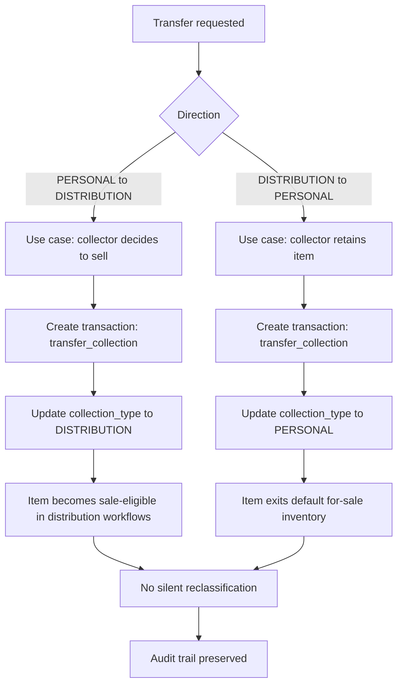
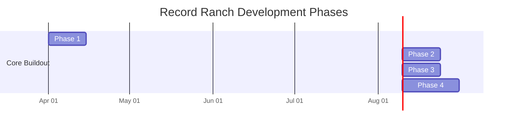

# Record Ranch Inventory System – Design

## Overview

A private inventory system supporting:

- Discogs-based cataloging
- Transaction-driven lifecycle
- Dual collection model

---

## Core Concepts

### Collection Type (NEW)

Each inventory item belongs to one of:

- PERSONAL
- DISTRIBUTION

---

## Data Model Updates

### Inventory Item (Updated)

```sql
inventory_item (
  id PK,
  pressing_id FK,
  collection_type TEXT CHECK (collection_type IN ('PERSONAL','DISTRIBUTION')),
  condition_media,
  condition_sleeve,
  status,
  created_at
)
```

---

### Inventory Transaction (Updated)

```sql
inventory_transaction (
  id PK,
  inventory_item_id FK,
  transaction_type,
  price NUMERIC,
  counterparty TEXT,
  notes TEXT,
  created_at TIMESTAMP
)
```

---

### Transaction Types

- acquisition
- sale
- transfer_collection   <-- NEW
- trade
- loss
- adjustment

---

## Collection Rules

### PERSONAL Collection

- Default: not for sale
- Sale requires explicit action
- May have:
  - premium pricing
  - restricted visibility

---

### DISTRIBUTION Collection

- Default: available for sale
- Standard workflows apply

---

## Transfer Workflow (Critical)

### PERSONAL → DISTRIBUTION

Use case:
- Collector decides to sell

Action:
- Create transaction:
  - type: transfer_collection
- Update:
  - collection_type = DISTRIBUTION

---

### DISTRIBUTION → PERSONAL

Use case:
- Collector retains item

Same transaction model

### Transfer Workflow Diagram



---

## API Updates

POST /inventory/acquire
POST /inventory/{id}/sell
POST /inventory/{id}/transfer
GET  /inventory?collection=PERSONAL|DISTRIBUTION
GET  /transactions
POST /imports/access/validate
POST /imports/access/commit
GET  /imports/{id}
GET  /imports/{id}/errors

---

## UI Behavior

### Personal Collection

- Visually distinct (badge/label)
- Sale action requires confirmation
- Possibly hidden from “for sale” views

### Distribution Inventory

- Default listing view
- Optimized for quick sales workflows

---

## Pricing Behavior

### Personal Collection

- Manual pricing
- Optional premium multiplier (future)

### Distribution

- Market-based pricing (Discogs integration later)

---

## Auditability

- All collection changes recorded as transactions
- No silent reclassification

---

## Backup Strategy

Unchanged:
- RDS PITR
- S3 snapshot export
- logical backups

---

## Legacy Microsoft Access Import Design

### Source Model (Observed)

The legacy Access database centers on an `Albums` table with lookup relationships to:

- `Artists`
- `Labels`
- `Channel`
- `Cover Conditions`
- `Record Conditions`

Observed `Albums` fields include:

- Artist
- ArtistSort
- Title
- Label
- Number (catalog number)
- Discogs#
- Year
- Value
- SortOrder
- LabelDesc
- Channel
- CoverCond
- RecordCond
- CoverStyle
- CutoutMark
- Remarks
- Bonuses
- Country/Club

### Import Goals

- Preserve historical inventory without manual re-entry
- Keep provenance for every imported row
- Normalize into canonical local schema while retaining long-tail legacy attributes
- Produce deterministic, repeatable imports (idempotent by source key)

### Import File Contract

Initial supported import format:

- CSV exports from Access tables
- Required file: `albums.csv`
- Optional lookup files:
  - `artists.csv`
  - `labels.csv`
  - `channel.csv`
  - `cover_conditions.csv`
  - `record_conditions.csv`

### Staging Strategy

- Parse uploads into staging tables keyed by:
  - `import_batch_id`
  - `source_row_number`
  - `source_hash`
- Validate all rows before commit
- No direct writes from uploaded files into canonical inventory tables

### Canonical Mapping Strategy

Use a two-pass mapping process.

Pass A: metadata and pressing resolution

- Prefer `Discogs#` as external identity key when present
- Map metadata into `pressing` (title, artist sort, label, catalog number, year, country)
- Retain legacy-only fields in import metadata for traceability

Pass B: inventory item and transaction creation

- Create `inventory_item` with mapped condition and status fields
- Default `collection_type` to `PERSONAL` unless import options explicitly specify otherwise
- Create one `inventory_transaction` per imported item:
  - `transaction_type = acquisition`
  - notes include import batch id and source reference

### Field Mapping (Initial)

| Access `Albums` field | Local target | Notes |
|-----|-----------|------|
| Artist | `pressing.raw_payload_json` and/or `pressing_credit.name` | retain exact source artist text; canonical artist normalization is a later phase |
| ArtistSort | `pressing.artists_sort` | preferred sort key |
| Title | `pressing.title` | required for canonical display |
| Label | `pressing_label.name` | normalize against lookup |
| Number | `pressing_label.catno` | source says include prefix |
| Discogs# | `pressing.discogs_release_id` | primary external key if valid |
| Year | `pressing.year` | integer coercion with validation |
| Value | import transaction metadata | estimated value, not guaranteed cost basis |
| Channel | imported as legacy attribute initially | candidate enum later |
| CoverCond | `inventory_item.condition_sleeve` | map via condition lookup |
| RecordCond | `inventory_item.condition_media` | map via condition lookup |
| CoverStyle | legacy attributes | preserve until canonicalized |
| CutoutMark | legacy attributes | preserve |
| Remarks | notes/legacy attributes | long text preservation |
| Bonuses | legacy attributes | preserve |
| Country/Club | `pressing.country` plus import flag | may contain combined semantics |

### Validation Rules

- Reject commit when required columns are missing
- Warn (not fail) on optional lookup mismatches
- Fail rows with irrecoverable key problems:
  - empty Title with no Discogs#
  - invalid numeric coercion for Year when provided
- Normalize known text fields before dedupe

### Dedupe Rules

Primary key path:

- `discogs_release_id` when present and valid

Fallback key path:

- normalized `(ArtistSort, Title, Label, Number, Year)` composite

### Auditability Requirements

- Every import run has a durable batch record
- Every created or updated inventory item is traceable to:
  - import batch id
  - source file
  - source row number
- Import summary includes inserted, updated, skipped, and failed counts

### UI Requirements for Import

- Upload step with file-level validation status
- Dry-run preview before commit
- Error export for failed rows
- Commit confirmation with summary report

---

## Discogs Integration Design

### API Contract

- Required headers:
  - `User-Agent` must be unique to this application
  - `Accept` should target Discogs v2 media type for predictable responses
- Access model:
  - Public database reads can be unauthenticated
  - User-specific collection, wantlist, and marketplace actions require authenticated access
- Error handling:
  - Handle `401`, `403`, `404`, `405`, `422`, and `5xx` responses explicitly

### Rate Limiting and Throttling

- Design assumptions:
  - Authenticated requests: ~60/minute
  - Unauthenticated requests: ~25/minute
- Client behavior:
  - Read and respect `X-Discogs-Ratelimit`, `X-Discogs-Ratelimit-Used`, and `X-Discogs-Ratelimit-Remaining`
  - Use local request throttling and bounded retry backoff

### Pagination Rules

- Default page size is 50
- Max page size is 100
- Sync jobs must follow both:
  - `Link` response header relations (`next`, `prev`, `first`, `last`)
  - Response body `pagination` object

### Schema Extension Strategy

Hybrid storage is required to support Discogs payload breadth without over-normalizing early.

- Keep `inventory_item` focused on local ownership/lifecycle state
- Expand `pressing` as the Discogs-linked metadata anchor
- Add a raw payload field for long-tail attributes
- Normalize selected arrays into child tables where queryability is needed

Recommended `pressing` extension fields:

- identity and linkage:
  - `discogs_release_id` (unique)
  - `discogs_master_id` (nullable)
  - `discogs_resource_url`
- core metadata:
  - `title`, `artists_sort`, `year`, `country`, `released`, `released_formatted`
  - `data_quality`, `status`
- market and community signals:
  - `num_for_sale`, `lowest_price`
  - `community_have`, `community_want`, `community_rating_avg`, `community_rating_count`
- sync and provenance:
  - `source_last_changed_at` (from Discogs)
  - `last_synced_at`
  - `sync_status`
  - `raw_payload_json`

Recommended child tables (phaseable):

- `pressing_identifier` (type, value, description)
- `pressing_track` (position, title, duration, type)
- `pressing_image` (type, uri, uri150, width, height)
- `pressing_video` (uri, title, duration, embed)
- `pressing_credit` (name, role, anv, discogs_artist_id)
- `pressing_company` (name, role/entity type, discogs_label_id)
- `pressing_label` (name, catno, discogs_label_id)

### Proposed SQL Schema (Concrete Target)

The following target schema is intended for PostgreSQL and can be implemented with Alembic migrations.

```sql
-- Existing inventory tables remain system-of-record for ownership state.

ALTER TABLE pressing
  ADD COLUMN discogs_release_id BIGINT,
  ADD COLUMN discogs_master_id BIGINT,
  ADD COLUMN discogs_resource_url TEXT,
  ADD COLUMN title TEXT,
  ADD COLUMN artists_sort TEXT,
  ADD COLUMN year INTEGER,
  ADD COLUMN country TEXT,
  ADD COLUMN released_text TEXT,
  ADD COLUMN released_formatted TEXT,
  ADD COLUMN status TEXT,
  ADD COLUMN data_quality TEXT,
  ADD COLUMN num_for_sale INTEGER,
  ADD COLUMN lowest_price NUMERIC(12,2),
  ADD COLUMN community_have INTEGER,
  ADD COLUMN community_want INTEGER,
  ADD COLUMN community_rating_avg NUMERIC(4,2),
  ADD COLUMN community_rating_count INTEGER,
  ADD COLUMN source_last_changed_at TIMESTAMPTZ,
  ADD COLUMN last_synced_at TIMESTAMPTZ,
  ADD COLUMN sync_status TEXT,
  ADD COLUMN raw_payload_json JSONB;

CREATE UNIQUE INDEX IF NOT EXISTS ux_pressing_discogs_release_id
  ON pressing (discogs_release_id)
  WHERE discogs_release_id IS NOT NULL;

CREATE INDEX IF NOT EXISTS ix_pressing_discogs_master_id ON pressing (discogs_master_id);
CREATE INDEX IF NOT EXISTS ix_pressing_title ON pressing (title);
CREATE INDEX IF NOT EXISTS ix_pressing_artists_sort ON pressing (artists_sort);
CREATE INDEX IF NOT EXISTS ix_pressing_year ON pressing (year);
CREATE INDEX IF NOT EXISTS ix_pressing_country ON pressing (country);
CREATE INDEX IF NOT EXISTS ix_pressing_last_synced_at ON pressing (last_synced_at);

CREATE TABLE IF NOT EXISTS pressing_identifier (
  id BIGSERIAL PRIMARY KEY,
  pressing_id BIGINT NOT NULL REFERENCES pressing(id) ON DELETE CASCADE,
  identifier_type TEXT NOT NULL,
  value TEXT NOT NULL,
  description TEXT,
  created_at TIMESTAMPTZ NOT NULL DEFAULT NOW()
);

CREATE UNIQUE INDEX IF NOT EXISTS ux_pressing_identifier_key
  ON pressing_identifier (pressing_id, identifier_type, value, COALESCE(description, ''));

CREATE TABLE IF NOT EXISTS pressing_track (
  id BIGSERIAL PRIMARY KEY,
  pressing_id BIGINT NOT NULL REFERENCES pressing(id) ON DELETE CASCADE,
  position TEXT,
  track_type TEXT,
  title TEXT NOT NULL,
  duration_text TEXT,
  created_at TIMESTAMPTZ NOT NULL DEFAULT NOW()
);

CREATE INDEX IF NOT EXISTS ix_pressing_track_pressing_id ON pressing_track (pressing_id);

CREATE TABLE IF NOT EXISTS pressing_image (
  id BIGSERIAL PRIMARY KEY,
  pressing_id BIGINT NOT NULL REFERENCES pressing(id) ON DELETE CASCADE,
  image_type TEXT,
  uri TEXT NOT NULL,
  uri150 TEXT,
  width INTEGER,
  height INTEGER,
  created_at TIMESTAMPTZ NOT NULL DEFAULT NOW()
);

CREATE UNIQUE INDEX IF NOT EXISTS ux_pressing_image_uri
  ON pressing_image (pressing_id, uri);

CREATE TABLE IF NOT EXISTS pressing_video (
  id BIGSERIAL PRIMARY KEY,
  pressing_id BIGINT NOT NULL REFERENCES pressing(id) ON DELETE CASCADE,
  uri TEXT NOT NULL,
  title TEXT,
  description TEXT,
  duration_seconds INTEGER,
  embed BOOLEAN,
  created_at TIMESTAMPTZ NOT NULL DEFAULT NOW()
);

CREATE UNIQUE INDEX IF NOT EXISTS ux_pressing_video_uri
  ON pressing_video (pressing_id, uri);

CREATE TABLE IF NOT EXISTS pressing_credit (
  id BIGSERIAL PRIMARY KEY,
  pressing_id BIGINT NOT NULL REFERENCES pressing(id) ON DELETE CASCADE,
  discogs_artist_id BIGINT,
  name TEXT NOT NULL,
  anv TEXT,
  role TEXT,
  tracks TEXT,
  created_at TIMESTAMPTZ NOT NULL DEFAULT NOW()
);

CREATE INDEX IF NOT EXISTS ix_pressing_credit_pressing_id ON pressing_credit (pressing_id);
CREATE INDEX IF NOT EXISTS ix_pressing_credit_artist_id ON pressing_credit (discogs_artist_id);

CREATE TABLE IF NOT EXISTS pressing_company (
  id BIGSERIAL PRIMARY KEY,
  pressing_id BIGINT NOT NULL REFERENCES pressing(id) ON DELETE CASCADE,
  discogs_label_id BIGINT,
  name TEXT NOT NULL,
  entity_type_code TEXT,
  entity_type_name TEXT,
  created_at TIMESTAMPTZ NOT NULL DEFAULT NOW()
);

CREATE INDEX IF NOT EXISTS ix_pressing_company_pressing_id ON pressing_company (pressing_id);
CREATE INDEX IF NOT EXISTS ix_pressing_company_label_id ON pressing_company (discogs_label_id);

CREATE TABLE IF NOT EXISTS pressing_label (
  id BIGSERIAL PRIMARY KEY,
  pressing_id BIGINT NOT NULL REFERENCES pressing(id) ON DELETE CASCADE,
  discogs_label_id BIGINT,
  name TEXT NOT NULL,
  catno TEXT,
  created_at TIMESTAMPTZ NOT NULL DEFAULT NOW()
);

CREATE INDEX IF NOT EXISTS ix_pressing_label_pressing_id ON pressing_label (pressing_id);
CREATE INDEX IF NOT EXISTS ix_pressing_label_label_id ON pressing_label (discogs_label_id);

-- Inventory-focused indexes for query and event retrieval patterns.
CREATE INDEX IF NOT EXISTS ix_inventory_item_collection_type ON inventory_item (collection_type);
CREATE INDEX IF NOT EXISTS ix_inventory_item_status ON inventory_item (status);
CREATE INDEX IF NOT EXISTS ix_inventory_item_pressing_id ON inventory_item (pressing_id);
CREATE INDEX IF NOT EXISTS ix_inventory_transaction_item_created
  ON inventory_transaction (inventory_item_id, created_at DESC);
```

### Migration Plan (Phased)

Phase A: core Discogs linkage

- Add core columns to `pressing`
- Add unique/indexed keys for `discogs_release_id` and common filters
- Start storing `raw_payload_json`, `last_synced_at`, and `sync_status`

Phase B: queryable detail tables

- Create `pressing_identifier`, `pressing_track`, `pressing_image`, `pressing_video`
- Create `pressing_credit`, `pressing_company`, `pressing_label`
- Implement idempotent upsert logic and release-scoped replace behavior

Phase C: performance hardening

- Add additional indexes based on observed query plans
- Add optional GIN index on `raw_payload_json` if ad hoc JSON queries are needed
- Add background sync metrics and stale-data re-sync jobs

### Discogs-to-Local Field Mapping (Initial)

| Discogs field | Local target | Notes |
|-----|-----------|------|
| `id` | `pressing.discogs_release_id` | Unique upsert key |
| `master_id` | `pressing.discogs_master_id` | Nullable |
| `resource_url` | `pressing.discogs_resource_url` | Source pointer |
| `title` | `pressing.title` | Core display/search |
| `artists_sort` | `pressing.artists_sort` | Search/sort |
| `year` | `pressing.year` | Numeric year |
| `country` | `pressing.country` | Country facet |
| `released` | `pressing.released_text` | Preserve partial dates |
| `released_formatted` | `pressing.released_formatted` | Display-friendly |
| `status` | `pressing.status` | Discogs entry status |
| `data_quality` | `pressing.data_quality` | Quality signal |
| `num_for_sale` | `pressing.num_for_sale` | Market signal |
| `lowest_price` | `pressing.lowest_price` | Market signal |
| `community.have` | `pressing.community_have` | Demand/supply proxy |
| `community.want` | `pressing.community_want` | Demand/supply proxy |
| `community.rating.average` | `pressing.community_rating_avg` | Rating summary |
| `community.rating.count` | `pressing.community_rating_count` | Rating sample size |
| `date_changed` | `pressing.source_last_changed_at` | Source freshness |
| `identifiers[]` | `pressing_identifier` rows | One-to-many |
| `tracklist[]` | `pressing_track` rows | One-to-many |
| `images[]` | `pressing_image` rows | One-to-many |
| `videos[]` | `pressing_video` rows | One-to-many |
| `extraartists[]` | `pressing_credit` rows | One-to-many |
| `companies[]` | `pressing_company` rows | Role-aware |
| `labels[]` | `pressing_label` rows | One-to-many |
| full response JSON | `pressing.raw_payload_json` | Long-tail and audit |

### Data Quality and Normalization Notes

- Partial dates may appear (example pattern: `YYYY-MM-00`)
- Repeated entities may appear with different roles; dedupe must include role context
- Long text fields (for example notes) require unbounded text storage
- Arrays can be empty or omitted; parsers must tolerate null/empty cases

### Image Handling

- Treat image URLs as opaque values and store exactly as returned
- Do not infer or mutate URL segments
- Optional later phase:
  - local image caching with integrity and refresh policy

### Sync Workflow

1. Search or resolve Discogs release ID
2. Fetch release payload from Discogs API
3. Upsert `pressing` by `discogs_release_id`
4. Replace/upsert selected child-table rows for the release
5. Persist raw payload snapshot and sync metadata
6. Link local `inventory_item` rows to `pressing_id`

### Compliance and Licensing

- Discogs data includes both open and restricted categories depending on terms
- Integration must follow Discogs API terms and application naming/description policy
- Internal usage policy should define what fields are stored, surfaced, and redistributed

---

## Risks

| Risk | Mitigation |
|-----|-----------|
| accidental sale of personal item | confirmation + UI separation |
| incorrect classification | allow easy transfer |
| pricing confusion | separate pricing flows |

---

## Deferred Features

- automated pricing rules
- valuation tracking for personal collection
- image support

---

## Development Plan Updates

### Phase 1
- acquisition + collection assignment

### Phase 2
- transfer workflows

### Phase 3
- pricing differentiation

### Phase 4
- analytics + valuation

### Development Roadmap Diagram



---

## Summary

This system now supports:

- inventory lifecycle tracking
- dual-purpose collection management
- clear separation of collector vs dealer intent

This aligns with real-world usage of serious collectors who also operate as sellers.
